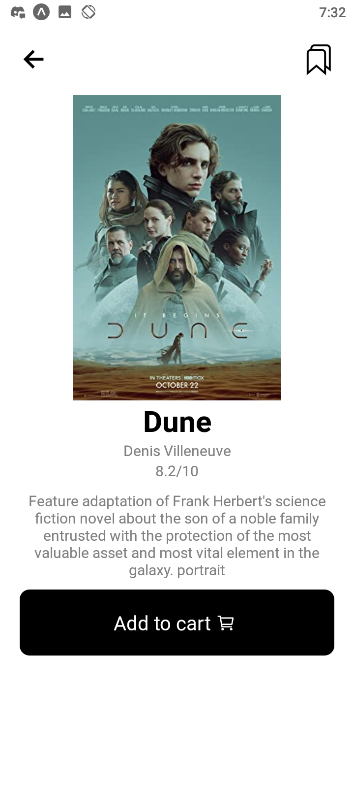

<h1>Movies App</h1>

<a href="https://expo.dev/@uwemneku/Book-store">Expo Link</a>

<h2>Tools<h2>
<table>
<tr>
<td>Naviagtion</td>
<td>
    <a>React Navigation</a>
     
    <a>Shared Element Navigation</a>
</td>
</tr>
<tr>
<td>Animation</td>
<td>
    <a>Reanimated 2</a>
</td>
</tr>
<tr>
<td>State Management</td>
<td>
    <a>React Context</a>
</td>
</tr>
</table>